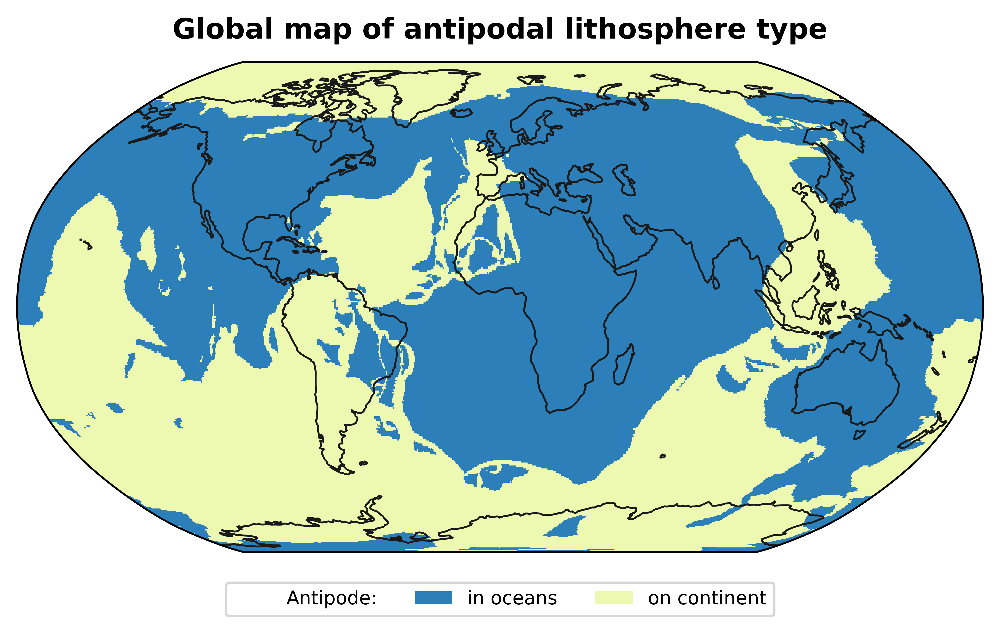
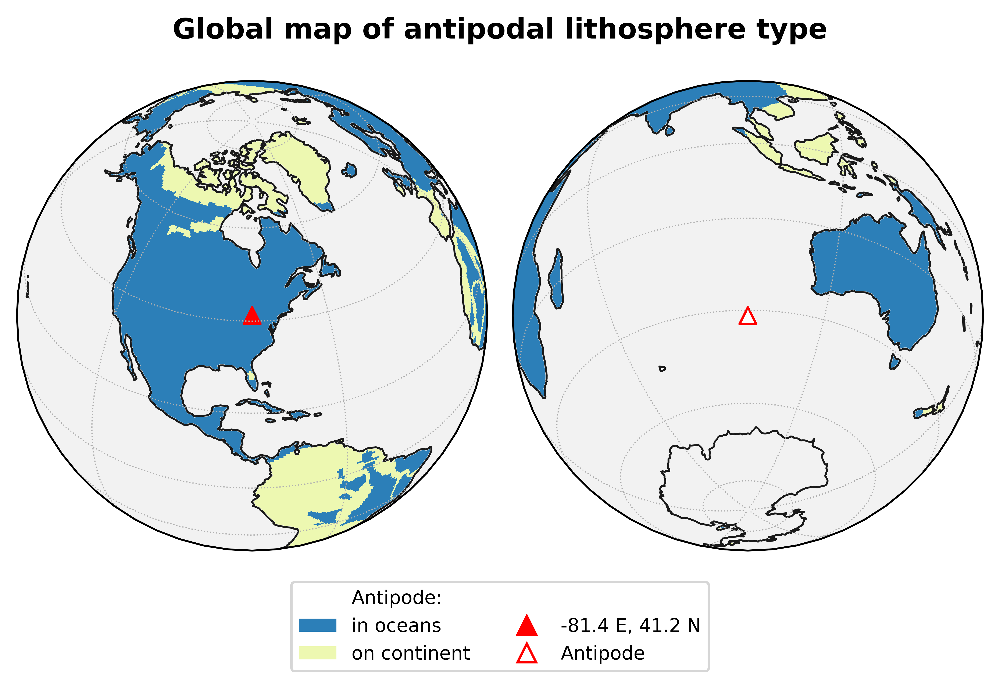
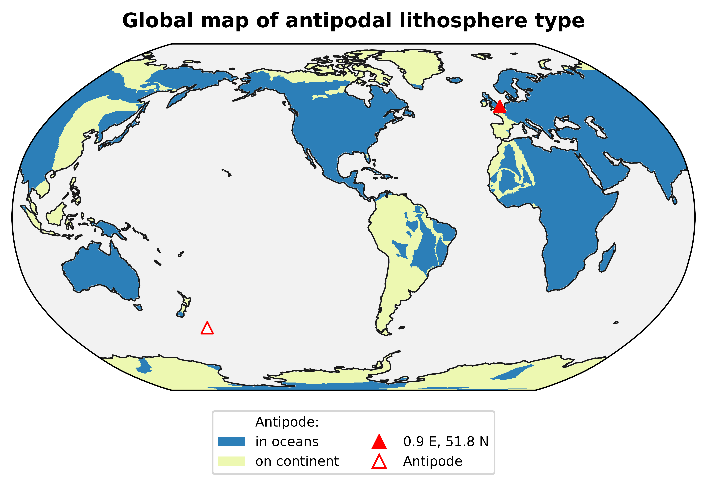
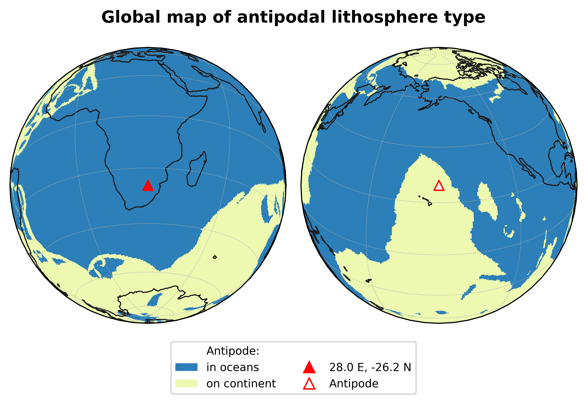

# Global Antipode Maps

## Introduction
When I've taught Introductory Geology, in one of my first classes I go over the structure of the Earth. It's good to set the stage on which the rest of the stuff we talk about plays out, and also get an early start on overcoming some fairly solidly held misconceptions about the relative thicknesses of the crust, mantle, and core, and the nature of the mantle (_not_ molten, except in very particular circumstances!).

I do this by drilling an imaginary hole through the centre of the Earth[^1]. If you start at most points on the Earth's continents, the antipode where you end up is in an ocean basin[^2], which means there is an easy way to compare and contrast the continental and oceanic lithosphere. 

Although [there are](https://commons.wikimedia.org/wiki/File:Antipodes_LAEA.png) [maps out there](https://thomasguymer.co.uk/blog/2018/2018-04-05/) that overlay the transposed outlines of the continents to illustrate the location of antipodes, but I've never really found one I truly liked. Part of this is that the physiographic oceans and continents do not exactly map onto regions of continental and oceanic crust. 

So when I discovered while playing around with Hasterok at al. (2022)'s [recently published](https://doi.org/10.1016/j.earscirev.2022.104069) set of [updated global tectonic and geological province boundaries](https://github.com/dhasterok/global_tectonics) that each of their plate polygons had an attribute telling you whether it was composed of oceanic or continental crust[^3], I decided to see what that could get me. 

## Antipode Grid
Using the Hasterok et al. polygons I generated a global grid that classified each point on the earth's surface based on a comparison to the nature of the crust at each point on the Earth's surface, and it's antipode. The code to do this is not currently included, but it was basically a simple search for which polygons a point and its antipode lay within, extracting the crustal_type attribute, and assigning a category based on their values. The file antipode_grid.nc contains this grid in NetCDF4 format, with the following values:

- 1: continent -> ocean
- 2: continent -> continent
- 3: ocean -> continent
- 4: ocean -> ocean

## Plotting maps
antipode_plotters.py contains two plotting functions that use the grid, antipode_map_Robinson() and antipode_map_Perspective.

There are a number of options for both functions:
- ShowOceans: set to True to show antipode values for the oceans. Defaults to False (only antipodes to continents are shown)
- ShowPoint: by default is set to True and shows a point in the NE US and its antipode in the SW Indian Ocean. The location of the point can be changed by supplying pointlong and pointlat values when calling the function, and setting ShowPoint=False will show no point.  
- filename: if supplied will save a png with the given path and name. If not supplied, no file will be created but image should display in interactive mode.  

Additional function for antipode_map_Robinson()
- Recenter: if set to true, the central longitude of the map (usually 0 E) will be set to the average of the point and antipodal longitudes. Useful for when point or antipode is close to 0º or ± 180ºE. 

make_antipode_maps.py has the code to load the antipode grid and put in a format that can be read by the two plotting functions.

	‌antipodes=xr.open_dataset('antipode_grid.nc')
	antipodes.close()
	X,Y=np.meshgrid(antipodes.coords['Long'].values,antipodes.coords['Lat'].values)
	result=antipodes.antipode_type.values

We can then call the plotting functions:

	fig=antipode_map_Robinson(X,Y,result, ShowOceans=True, ShowPoint=False, filename="./images/Antipodal_Lithosphere_Type_With_Oceans_Robinson.png")

	fig=antipode_map_Perspective(X,Y,result, filename="./images/Antipodal_Lithosphere_Ohio_No_Oceans_Perspective.png")

	fig=antipode_map_Robinson(X,Y,result, Recenter=True, pointlat=51.80, pointlong=0.9, filename="./images/Antipodal_Lithosphere_UK_No_Oceans_Robinson.png")
	

	fig=antipode_map_Perspective(X,Y,result, pointlat=-26.2, pointlong=28.0, filename="./images/Antipodal_Lithosphere_SA_With_Oceans_Perspective.png")

These and some other examples can be found in the 'images' directory.

## Dependencies
To work this code requires the following libraries:
- numpy
- xarray
- cartopy
- matplotlib

[^1]: This approach was partly inspired by [this book](https://bookshop.org/p/books/how-to-dig-a-hole-to-the-other-side-of-the-world-faith-mcnulty/592353?ean=9780064432184).
[^2]: Not surprising, given that 70% of the Earth’s surface is taken up by the oceans.
[^3]: This does make their plate model a bit complicated, since a geodynamically coherent master plate might be divided into a number of subplates with different attributes.